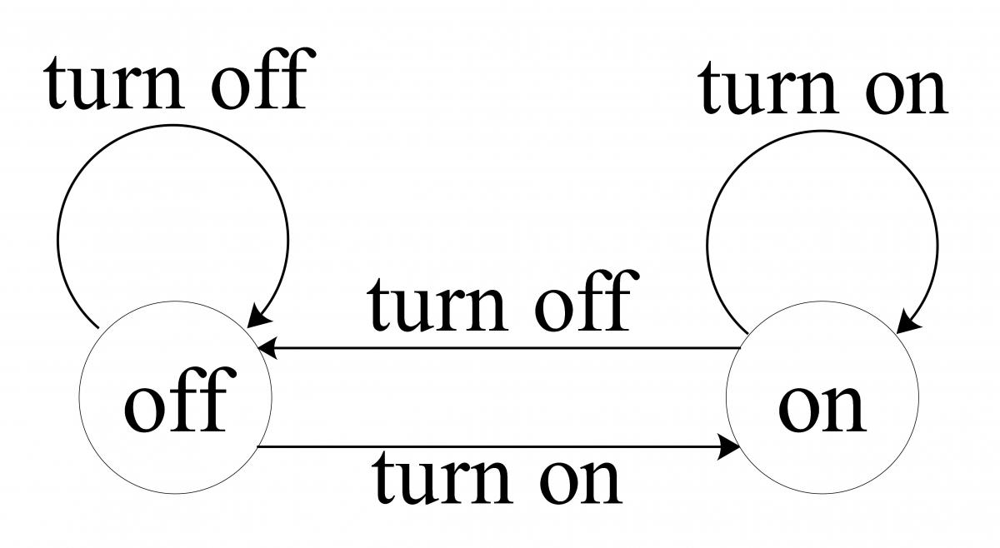
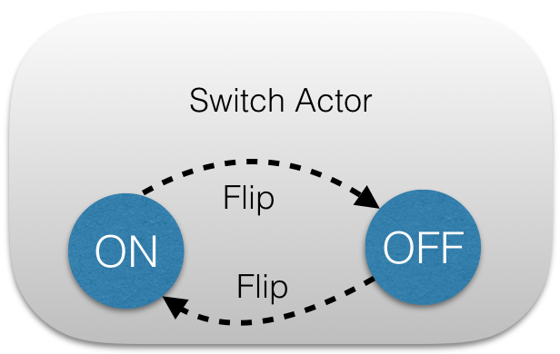
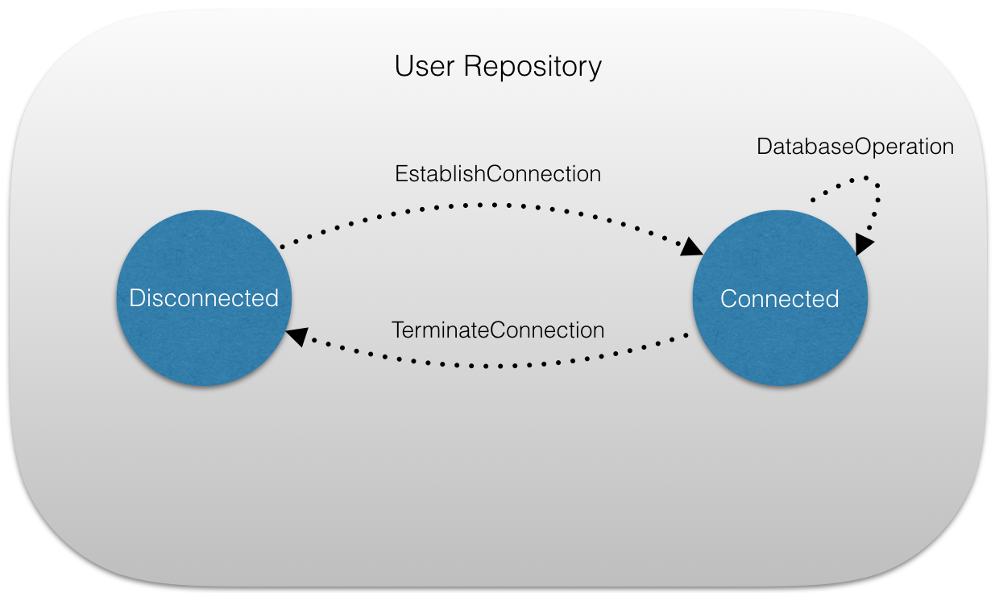
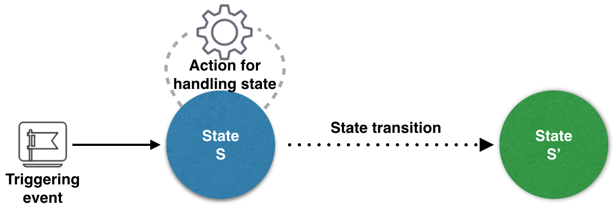
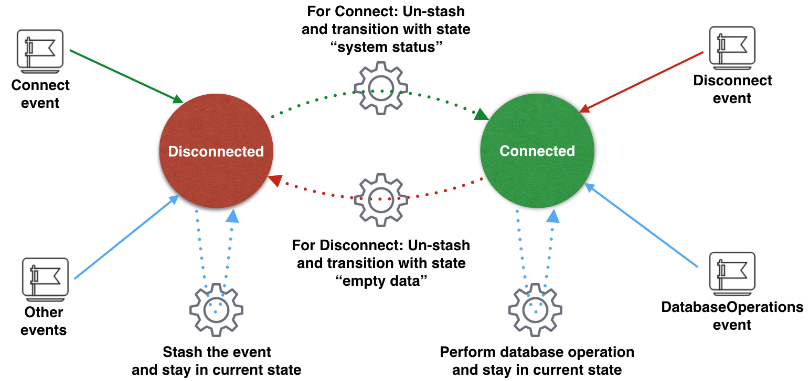

Objective 1: Change actor's behaviour via become and un-become
================================================================

Akka supports hot swapping an actor's message loop at runtime.    

## Hot-swapping

By invoking `context.become` method from within the Actor, current behaviour of an actor can be changed. The method `become` of an actor takes a `PartialFunction[Any, Unit]`, that implements a new message handler.

The hot-swapped code (i.e. new behaviour placed via become) is kept internally in a _stack_; which can either be 
* **popped** using `unbecome`. In this case, the actor will revert to its original behaviour. One must ensure that the number of pop operations (i.e. unbecome) matches the number of “push” operations in the long run; otherwise it'd amount to memory leak. 
* **pushed** again using `become`; which will essentially once again replace the current behavior (i.e. the top of the behavior stack).

Become and unbecome pair approach is the recommended when the application needs to handle only two states.

### Stash

`Trait` that enables an actor to temporarily stash away messages, that should not be handled using the actor’s current message handling behaviour.

Typically, when making a state transition via `become` or `unbecome` method calls, one can choose to `unstash` messages (i.e. prepend them to actor's mailbox) so that, stashed messages can be processed in the same order as they were originally received.
 
#### Stash usage
 
 * Invoking `stash()` adds the current message to the actor’s stash. 
    * stash may be bounded in which case invoking `stash()` may result in a `StashOverflowException`.
 * Invoking `unstashAll()` enqueues messages from the stash to the actor’s mailbox until the capacity of the mailbox (if any) has been reached.
    * In case a bounded mailbox overflows, a MessageQueueAppendFailedException is thrown.
    * The stash is guaranteed to be empty after calling `unstashAll()`.

## Switch application

The `Switch` actor showcases hot-swapping behaviour via `become` and `unbecome`. 
The actor supports two states namely **OFF** and **ON** where OFF is the initial state. It implements two method handlers for behaviour of the application in those two states.
 * Upon receiving a `Flip` message in ON state, a state transition is made to OFF state. All other messages are unsupported and hence ignored.
 * Upon receiving a `Flip` message in OFF state, a state transition is made to ON state. All other messages are unsupported and hence ignored.

The `Switch` actor is sent `Flip` message 5 times; after which the actor system is terminated.

Change of behaviour is triggered using `become` and `unbecome` pair i.e. through reverts.

## User repository application

The UserRepository actor also showcases hot-swapping behaviour via `become` and `unbecome`. 
The actor supports two states namely **DISCONNECTED** and **CONNECTED** where **DISCONNECTED** is the initial state. It implements two method handlers for behaviour of the application in those two states.
* While the actor is in '_Disconnected_' state, it transitions to '_Connected_' state only upon receiving '_EstablishConnection_' message. It does so unstashing all messages it previously stashed. The actor also stashes all '_DatabaseOperation_' messages when it is in the 'Disconnected' state.
* While the actor is in '_Connected_' state, it transitions to '_Disconnected_' state only upon receiving '_TerminateConnection_' message.
  

Change of behaviour is triggered using `become` and `unbecome` pair i.e. through reverts.

Objective 2: Finite state machine
================================================================

A Finite State Machine (FSM) can be described as a set of relationship of the following form.

> If the application is in _state_ **_S_** and an _event_ **_E_** occurs, it must performs _action_ **_A_** and make a transition to _state_ **_S'_**. 

The recommended best practise is to use a FSM when the application needs to handle more than two states. 

Akka provides a `FSM` actor trait that requires two type parameters for 
 * _States managed_ by the finite state machine - Typically a sealed trait serving as super type of all supported states, is specified in the type parameter.
 * _State data_ tracked by FSM module - Typically a sealed trait serving as super type of all supported state's data, is specified in the type parameter.

The body of actor usually defines a DSL to manage the state machine. There's one declaration of event handler per supported state, called state function.
  A state function is a partial function that accepts an event (containing a message and FSM actor) and returns its state. 
  
## User Repository's FSM implementation
  
  The FSM implementation of UserRepository actor supports following states 
  * Disconnected - Initial state of the FSM actor.
  * Connected
  
  State data supported by user repository FSM are
  * EmptyData - Associated with Disconnected state.
  * SystemStatus - Associated with Connected state.
  
  The diagram below depicts the functionality of User repository FSM actor
  
  